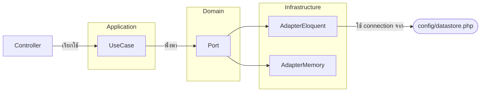

# DB.md – สคีมาฐานข้อมูลและหลักปฏิบัติ

ระบบนี้เริ่มต้นที่โมดูลข่าวประชาสัมพันธ์และการจัดการผู้ใช้ทีมงาน เอกสารนี้ระบุสคีมาตั้งต้น ความสัมพันธ์ที่ต้องรู้ และแนวทางออกแบบฐานข้อมูลเพิ่มเติมเมื่อขยายโดเมน รวมถึงสถาปัตยกรรม Hexagonal ที่ใช้ควบคุมการสลับแหล่งข้อมูล

## 0. สถาปัตยกรรม Hexagonal สำหรับ Datastore
- **Port (Domain Contracts):** ประกาศใน `App\Domain\<Aggregate>\Contracts` เช่น `UserRepository`
- **Use Case Layer:** อยู่ใน `App\Application\<Aggregate>` เรียกผ่าน interface เท่านั้น ไม่มีการอ้างอิง Eloquent ตรงๆ
- **Adapter:** อยู่ใน `App\Infrastructure\Persistence` แยกเป็น `Eloquent` และ `Memory`
- **Service Container Binding:** กำหนดใน `config/datastore.php` แล้วให้ `App\Providers\AppServiceProvider` bind interface → adapter ตามค่า ENV

### Mapping interface → adapter → connection ตัวอย่าง (User)
| Interface | Driver `eloquent` | Driver `memory` | Connection |
| --- | --- | --- | --- |
| `App\Domain\User\Contracts\UserRepository` | `App\Infrastructure\Persistence\Eloquent\UserRepository` | `App\Infrastructure\Persistence\Memory\UserRepository` | กำหนดผ่าน `DATASTORE_CONNECTION` เช่น `sqlite`, `mysql`, `pgsql`, `sqlsrv` |

เมื่อเพิ่ม aggregate ใหม่ให้เพิ่ม mapping ใน `config/datastore.php` และสร้าง adapter อย่างน้อย 1 แบบให้ผ่าน contract test

## 1. ตารางหลักที่มีในสตาร์ตเตอร์

### 1.1 `users`
- คอลัมน์สำคัญ: `id`, `name`, `email` (unique), `password` (bcrypt), `role` (`viewer/staff/admin`), timestamps
- Index: Laravel สร้าง unique index ให้ `email` อัตโนมัติ
- ใช้กับ Sanctum: token จะถูกบันทึกใน `personal_access_tokens` (สร้างโดยแพ็กเกจ)
- แนะนำให้เพิ่ม seeder สำหรับ `admin` ขั้นต่ำ 1 คนตอนเริ่มโครงการ

### 1.2 `news`
- คอลัมน์: `id`, `title` (string 200), `body` (longText nullable), `published_at` (datetime nullable), timestamps
- ใช้แสดงในหน้า public (`/api/news`) และหน้า staff (`/api/staff/news`)
- ควรสร้าง index เพิ่มบน `published_at` หากมีการ query ตามช่วงเวลา หรือใช้ fulltext บน `title/body` เมื่อต้องการค้นหา

> ER Diagram ตัวอย่างอยู่ใน `docs/db.drawio` สามารถเปิดด้วย draw.io แล้วปรับตามสคีมาจริงก่อน commit

## 2. การออกแบบสำหรับโมดูลเพิ่มเติม
- **แผนก / บุคลากร:** แนะนำตาราง `departments`, `doctors`, `services` ที่โยงถึงกันด้วย FK (`department_id`, `service_id`)
- **ข้อมูลผู้ป่วย:** หากเพิ่มตารางผู้ป่วย ให้แยกข้อมูลอ่อนไหว (PII/PHI) และเข้ารหัสฟิลด์สำคัญ พร้อมกำหนดสิทธิ์การเข้าถึง
- **สื่อ/ไฟล์แนบ:** แยกตาราง `media_assets` เก็บ metadata (path, mime, owner_type, owner_id) แล้วเชื่อมแบบ polymorphic
- **ประวัติการแก้ไข:** ใช้ตาราง `audits` หรือ Laravel Auditing package เพื่อบันทึกการเปลี่ยนแปลงที่สำคัญ

## 3. แนวปฏิบัติด้าน Migration และ Seed
1. ทุก migration ต้องเขียน `down()` เพื่อรองรับ rollback
2. ตั้งชื่อไฟล์ด้วย timestamp ตามมาตรฐาน Laravel เพื่อรักษาลำดับ
3. การเปลี่ยน schema ใน production ให้ใช้คำสั่ง `php artisan migrate --force` และสำรองข้อมูลก่อนทุกครั้ง
4. ใช้ Factory + Seeder ใน `database/seeders` เพื่อสร้างข้อมูลเริ่มต้น (เช่น admin user, ข่าวตัวอย่าง)
5. เมื่อมีการเพิ่ม enum/lookup ให้สร้าง Seeder แยกหรือใช้ `db:seed --class=LookupSeeder`

## 4. หลักการตั้งชื่อและชนิดข้อมูล
- คอลัมน์ใช้ `snake_case` สื่อความหมาย เช่น `published_at`, `department_id`
- ฟิลด์ boolean ให้ใช้ prefix `is_` หรือ `has_` เช่น `is_active`
- เก็บเวลาทั้งหมดเป็น `UTC` แล้วให้ frontend แปลง timezone
- ใช้ `uuid` สำหรับข้อมูลที่ต้องอ้างอิงจากระบบภายนอกหรือรองรับ sharding ในอนาคต

## 5. การจัดการข้อมูลและประสิทธิภาพ
- เปิดใช้ `strict` mode บน MySQL/MariaDB เพื่อป้องกัน silent truncation
- สำรวจ query ด้วย Laravel Telescope หรือ Debugbar ช่วงพัฒนา และเพิ่ม index เมื่อพบ N+1 หรือ query ช้า
- วางนโยบาย data retention: ข่าวเก่าอาจย้ายไปตาราง archive หรือ object storage หากไม่ต้องแสดงในระบบหลัก
- สร้าง job สำหรับ vacuum/optimize เป็นประจำ (เช่น ใช้ event ใน systemd timer)

## 6. การสำรองและกู้คืน (Backup & Restore)
- Production ควรสำรองฐานข้อมูลรายวันอย่างน้อย 7 ชุด (full) + differential/point-in-time หากรองรับ
- ทดสอบการกู้คืนบนสภาพแวดล้อม staging ทุกไตรมาส และอัปเดตเอกสารขั้นตอนลงใน `docs/RUNBOOK.md`
- บันทึกตำแหน่งไฟล์สำรองและผู้รับผิดชอบ (เจ้าของระบบฐานข้อมูล) ให้ชัดเจน

## 7. Checklist ก่อน merge การแก้ schema
- [ ] มี migration + down ครบถ้วน
- [ ] เขียน test ครอบคลุม (Feature/Unit/Integration) สำหรับการเปลี่ยนแปลง
- [ ] อัปเดต `docs/DB.md`, `docs/db.drawio`, และเอกสารที่เกี่ยวข้อง
- [ ] แจ้งทีม DevOps ให้เตรียมสำรองข้อมูลหากเป็น breaking change
- [ ] เตรียม script/command สำหรับ backfill หรือ data migration และทดสอบล่วงหน้า
