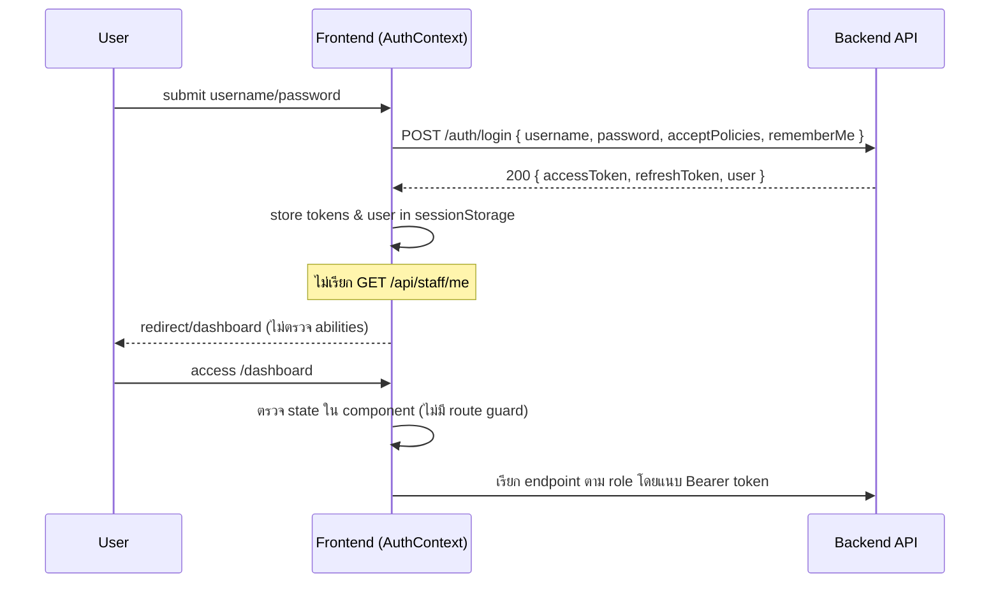

# Auth & RBAC Flow Audit

## Implementation snapshot
- `AuthContext` เรียก `secureApi.login` แล้วบันทึก `accessToken`, `refreshToken`, `user` ลง `sessionStorage` โดยไม่เรียก `/api/staff/me` ตามสัญญาหลังเข้าสู่ระบบ 【F:frontend/src/context/AuthContext.tsx†L16-L86】【F:docs/ROUTES.md†L126-L158】
- `secureApi.login` คาดหวัง response เป็น `{ accessToken, refreshToken, user }` ซึ่งต่างจากรูปแบบ `{ data: { token, user }, meta }` ที่เอกสารกำหนด และไม่อ่าน abilities จาก token 【F:frontend/src/lib/secureApi.ts†L60-L80】【F:docs/ROUTES.md†L160-L187】
- การ refresh token (`secureApi.refresh`) ส่ง `POST /auth/refresh` แต่เอกสารไม่มี endpoint ดังกล่าว ทำให้ flow เสี่ยงล้มเหลวเมื่อเชื่อมกับ API จริง 【F:frontend/src/lib/secureApi.ts†L77-L86】【F:docs/ROUTES.md†L160-L214】
- เส้นทาง `/dashboard` ไม่ได้ห่อด้วย `RequireAuth` (เพียงตรวจสอบในคอมโพเนนต์) ทำให้ผู้ใช้ไม่ล็อกอินยังเข้าถึงหน้าได้ แม้ UI จะแสดงข้อความแจ้ง แต่ resource ภายในจะยังเรียก API โดยไม่มี token 【F:frontend/src/router.tsx†L63-L88】【F:frontend/src/pages/dashboard/Dashboard.tsx†L1-L110】
- RBAC ตรวจสอบด้วย `user.role` เท่านั้น ไม่ได้อิง `abilities` ตามที่เอกสาร `SECURITY.md` ระบุ ส่งผลให้ token ที่มี ability ไม่ตรง role อาจผ่านการป้องกัน 【F:frontend/src/router.tsx†L34-L63】【F:docs/SECURITY.md†L11-L20】

## Mermaid sequence (ตามโค้ดปัจจุบัน)

## ช่องว่างสำคัญ
1. **Response shape mismatch** – ต้องปรับฝั่ง frontend ให้แปลง `{ data: { token, user } }` จาก backend ไม่ใช่ `{ accessToken, ... }`
2. **ไม่มีการ verify ด้วย `/api/staff/me`** – ไม่ตรง `docs/ROUTES.md` และขาดการ sync abilities/role ล่าสุด
3. **Route guard ไม่ครอบคลุม** – ควรใช้ `RequireAuth` กับ `/dashboard` และหน้าภายในทั้งหมดเพื่อกัน unauthenticated access
4. **ไม่มีการจัดการ 401/403 ตามเอกสาร** – `secureApi` ขว้าง `Error(message)` ที่ไม่ตรงกับ payload `{ error: { message } }` ทำให้ UX ไม่ทราบสถานะจริง 【F:frontend/src/lib/secureApi.ts†L41-L90】【F:docs/ROUTES.md†L214-L240】

## คำแนะนำการแก้ไขฝั่ง Front
- ปรับ `secureApi.request` ให้ map response จาก `{ data, meta }` และโยน error จาก `error.message`
- เรียก `GET /api/staff/me` หลัง login/refresh เพื่อตรวจ role + abilities ล่าสุดก่อน render dashboard
- ใช้ `RequireAuth` ครอบ `/dashboard` และเส้นทาง intranet ทั้งหมด พร้อม redirect ไปหน้า login เมื่อรับ 401/419
- เพิ่ม logic ตรวจสอบ ability (`user.abilities.includes('admin')`) ตาม Security policy ไม่ใช่แค่ role string
